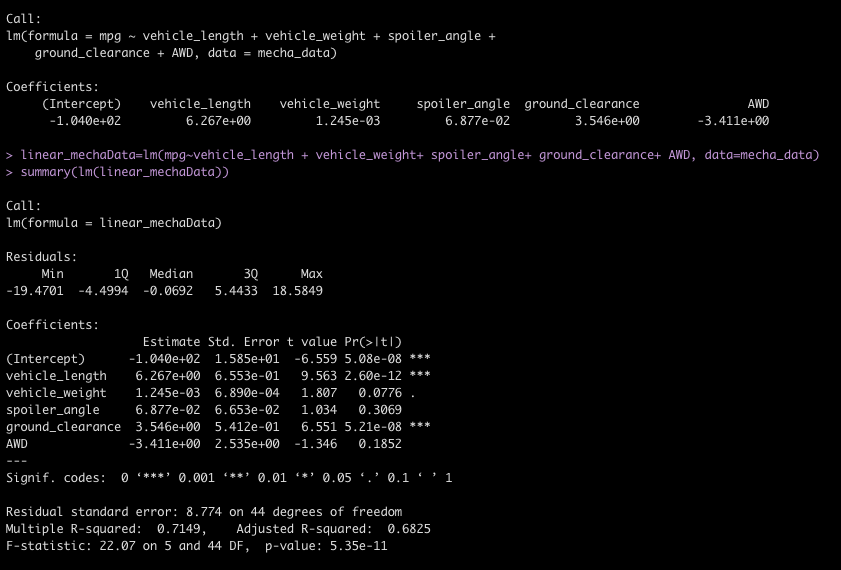
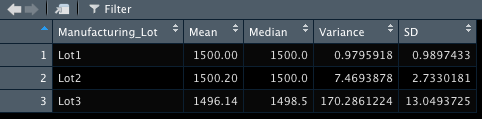
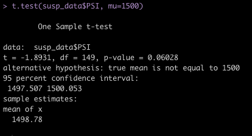
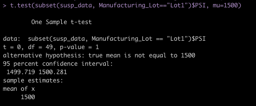
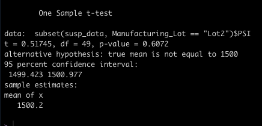
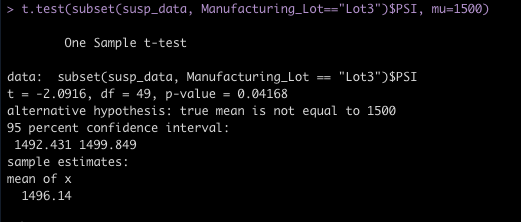

# MechaCar_Statistical_Analysis

## Linear Regression to Predict MPG

 </img>

- **Which variables/coefficients provided a non-random amount of variance to the mpg values in the dataset?**

    In our analysis, the variables that provided a non-random amount of variance to the MPG values were Intercept, Vehicle Length and Ground Clearance. All three variables/coefficients had an extremely high level of significance (0-0.001)

- **Is the slope of the linear model considered to be zero? Why or why not?**
    
    Because the p_value is much lower than the accepted 0.05 threshold, we can rule out our null hypothesis and establish that the slope of the model is not 0.

- **Does this linear model predict mpg of MechaCar prototypes effectively? Why or why not?**

    This model does not effectively predict the mpg of the MechaCar prototype because the significance of the Intercept variable is so high. This suggests that there are other extraneous variables within or beyond our dataset that are affecting our analysis.

## Summary Statistics on Suspension Coils ##

**The design specifications for the MechaCar suspension coils dictate that the variance of the suspension coils must not exceed 100 pounds per square inch. Does the current manufacturing data meet this design specification for all manufacturing lots in total and each lot individually? Why or why not?**

</img>

</img>

Overall the variance of the combined lots is 62.29356, which is less than 100 pound per square inch (PSI), our threshold for acceptable variance. When we take a look at the PSI per Manufacturing Lot, we discover that while the means and medians are seemingly similar across the board (within 5 PSI of each other), the variance for Lot 3 is much higher than both the other lots and is outside our threshold of 100 PSI. Lot 3's Variance is 170.2861224, and does not meet the design specifications variance of less than 100PSI that is required.

## T-Tests on Suspension Coils

**Briefly summarize your interpretation and findings for the t-test results. Include screenshots of the t-test to support your summary.**

The null hypothesis for this analysis is that the mean PSI of all manufacturing lots is not statistically different than the population mean of 1500. 

</img>

Using the t-test method on the PSI data of all manufacturing lots, we do not have enough data to reject our null hypothesis. The mean of the data set for all lots is equal to the population mean(within 95%). Our mean for the total sample is 1498.78, which is within our confidence interval.

</img>
Based on the t-test data for lot 1, we are not able to reject the null hypothesis that this data set is not statistically different than the population. Both the population mean and sample mean are 1500.

</img>
For the lot 2 sample, we are still unable to reject our null hypothesis. Our sample mean is within the the 95% confidence interval and has a p_value of 0.61, this and the sample mean of 1500.2, infers that we are not able to say with confidence that this samples mean is statistically different than the population mean of 1500.

</img>
The result of Manufacturing Lot 3's t-test has a much lower p_value than the other two lots. The p_value of 0.04 is lower than our accepted significance of 0.05 and the sample mean is outside of the accepted confidence interval. This means that we are able to reject the null hypothesis and deduce that there is, in fact, a statistical difference between this Manufacturing lot and the population mean.

## Study Design: MechaCar vs Competition

### 
 MechaCar vs. The Competition: 

 <b>Which is more Cost Effective by Year</b> 

Our analysis will evaluate the mean total yearly cost of the MechaCar as compared to the competition. Our study will collect monthly data over five years from a random sampling of users, controlling for climate and weather conditions to try to minimize the extraneous variables.

**What metric or metrics are you going to test?**
The metrics we will test are:
- Initial Cost : Total Cost to purchase 
- Maintenance Costs: repairs, preventative care etc.
- Running Costs: Incorporate MPG multiplied by mean gas price for each month/year.

**What is the null hypothesis or alternative hypothesis?**
The null hypothesis is that there is no statistical difference in yearly cost over the five year span. 

Hypothesis: The MechaCar has a higher or lower cost to consumer than the competition per year over the 5 year time period.

**What statistical test would you use to test the hypothesis? And why?**
Two-Sample T-test - comparing MechaCar to the Competitor
Measures of central tendency (Mean, Median, SD and Variance) for each cost factor.

Linear Regression- Running costs over the five years

**What data is needed to run the statistical test?**

The datasets needed for both the MechaCar and the Competition to conduct this analysis are:
- Sale price for each vehicle, before taxes
- Maintenance records and price/frequency of services
- MPG and Average monthly fuel cost per gallon

Assumptions
The data is available for at least 5 years. The data is for the first 5 years of a new vechicle of either the competition or MechaCar and 